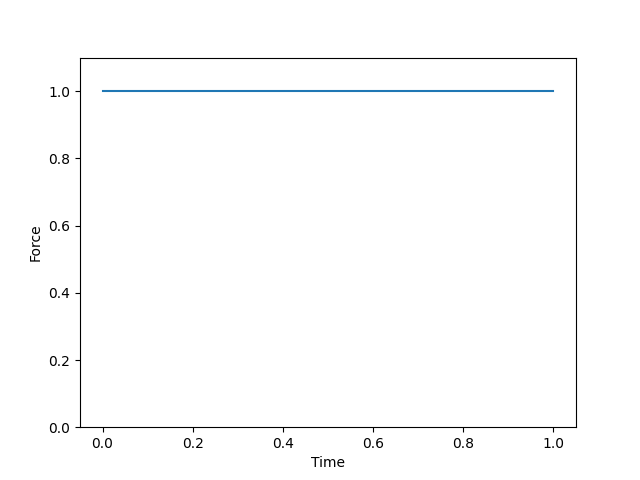
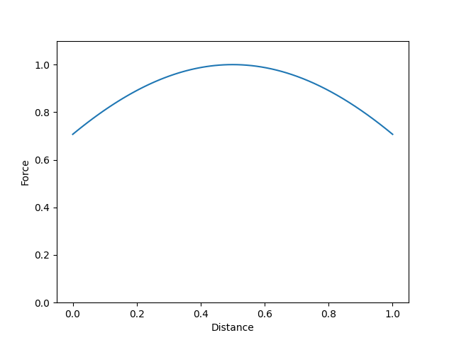
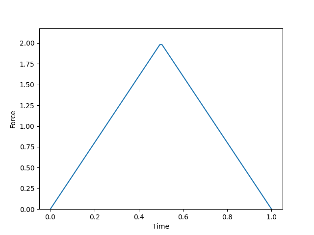
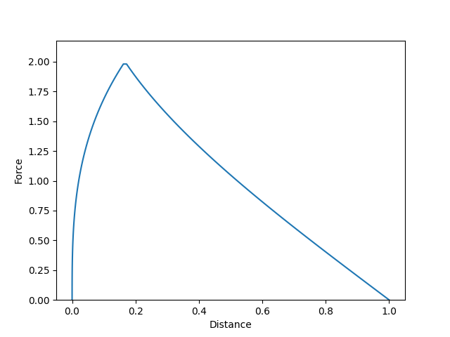
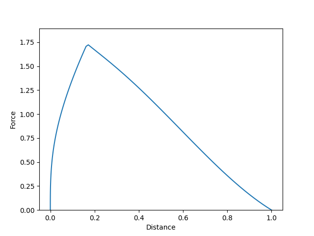
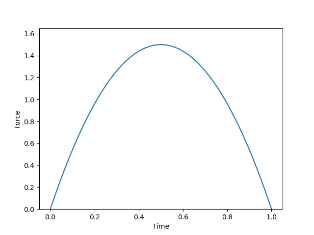
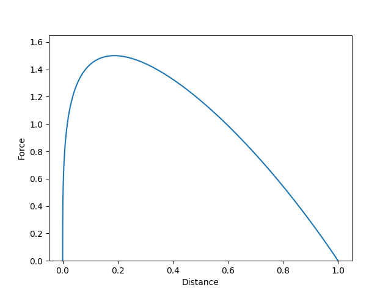
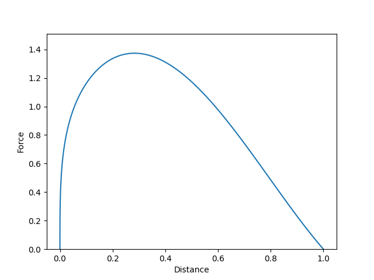

# Teoretisk uppställning

Roddmaskinens kraftkurva visar kraftutvecklingen över tid. Att det är tid som visas på x-axeln blir tydligt om man jämför långsamma och snabba roddrag. Det är dock oklart vad x-axeln visar, annat än att det är en kraft (ibland anges eneheten F och ibland kg, men inga siffror visas). Sensorn som används mäter rotationerna i hjulet, så det är ett rimligt antagande att det är rotationsfrekvensen som mäts, och att datorn i skärmen beräknar derivatan. Att inte visa siffror gör detta lättare eftersom de slipper konverteringsfaktorer från rotationella till linjära storheter, samt från acceleration till kraft.

Detta betyder även att kraften som visas är den totala kraften som agerar på hjulet, med friktion inräknat, och alltså inte den kraft som roddaren tillämpar på handtaget.

Målet är att beräkna arbetet som utförs på hjulet under ett roddrag, samt den energi som skulle ha riktas föröver om roddaren hade suttit i en båt på vattnet. Det första steget är att ta fram en kruva för kraft över distans, varefter en enkel integral ger arbetet.

Om vi tolkar kraften $F(t)$ som accelerationen (eftersom vi ändå inte har några siffror) så ges hastigheten av

$$
v(t) = \int_0^t F(\tau)\,\mathrm{d}\tau,
$$

där vi antar att hastigheten börjar från noll. Från detta ges roddavståndet av

$$
d(t) = \int_0^t v(\tau)\,\mathrm{d}\tau.
$$

Därefter kan ett enkelt variabelbyte ge kraften som en funktion av roddavståndet, alltså $F(d)$. Eftersom hastigheten ökar under roddraget så spenderar roddaren längre tid vid kort avstånd. Med andra ord så trycks kurvan $F(d)$ ihop mot vänster jämfört med $F(t)$, eftersom mer avstånd ges till roddragets andra halva än dess första halva (sett i tiden).

Från detta kan det totala arbetet (som utövas på hjulet, eller vattnet) beräknas genom

$$
W(d) = \int_0^dF(s)\,\mathrm{d}s.
$$

Eftersom vi inte har några siffror kan vi inte jämföra arbetet från två olika kraftkurvor. Däremot kan vi normera kraften med arbetet så att det totala arbetet (integralen ovan över hela längden) är enhetligt. Detta tillåter en jämförelse av vilken form av kraftkurva som ger störst energi föröver i båten.

Anta att åran sätts i vattnet med en vinkel $-\theta$ och tas upp med en vinkel $\theta$, där vinkeln mäts mellan årbladets normal och den akteröver pekande vektorn. Låt oss bortse från det faktum att årans rörelse är en rotation och anta att vinkeln varierar linjärt med handtagets bana. Den trigonometriska korrektionen som bör tillämpas är då $\cos\theta$ och energin som utövas i framåtgående riktning är

$$
W_\text{framåt} = \int_{-\theta}^\theta cos\theta\, F(\theta) \,\mathrm{d}\theta.
$$

# Numeriska resultat

## Konstant kraft

Anta en konstant kraft under hela roddraget, enligt följande graf: 

Kraften som en funktion av distansen är, även den, konstant. Kraften föröver som en funktion av distansen ges då av följande graf:

Den totala energin som ges till vattnet i framåtgående riktning, efter normering av kraften, är $W_\text{framåt}= 0.9003$.

## Triangelformad kraftprofil

Anta en triangelformad kraft under roddraget, enligt följande graf:

Kraften som en funktion av distansen ges då av följande graf:

Kraften föröver som en funktion av distansen ges då av följande graf:

Den totala energin som ges till vattnet i framåtgående riktning, efter normering av kraften, är $W_\text{framåt}=0.912$. Alltså är detta en något bättre profil än den konstanta.

## Kvadratisk kraftprofil

Anta en kvadratisk kraft under roddraget, enligt följande graf:

Kraften som en funktion av distansen ges då av följande graf:

Kraften föröver som en funktion av distansen ges då av följande graf:

Den totala energin som ges till vattnet i framåtgående riktning, efter normering av kraften, är $W_\text{framåt}=0.917$. Alltså är detta en något bättre profil än den konstanta och den triagelformade.
